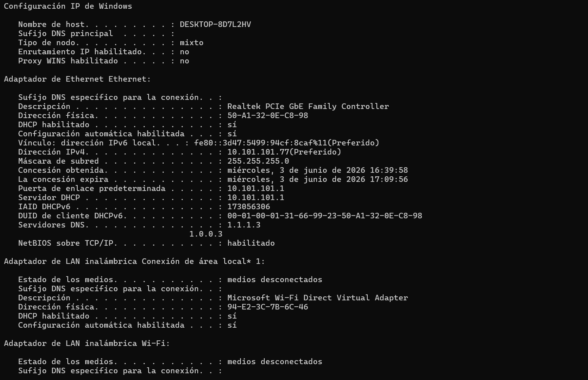
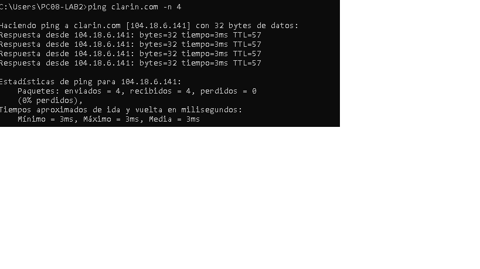
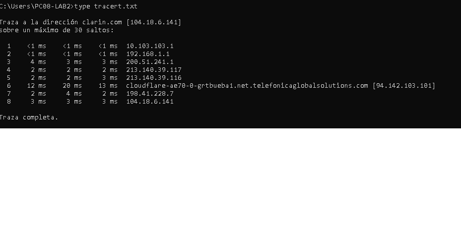
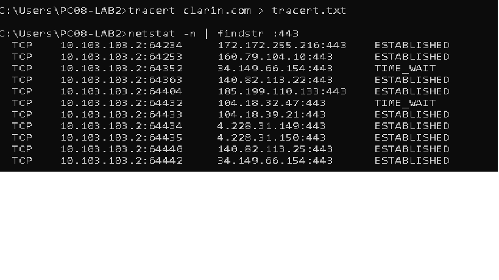
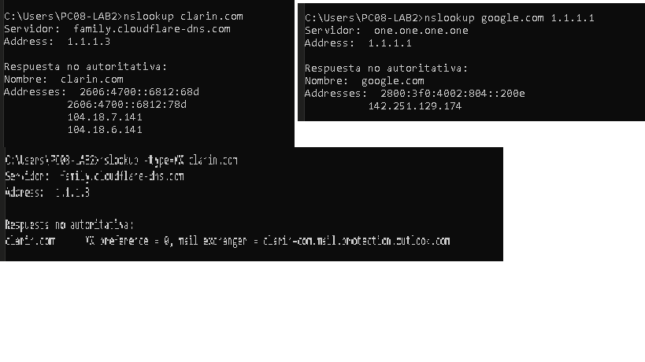
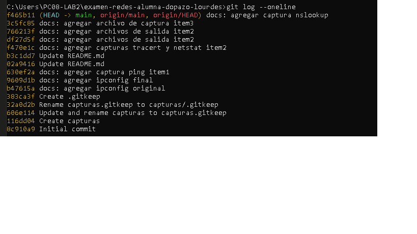
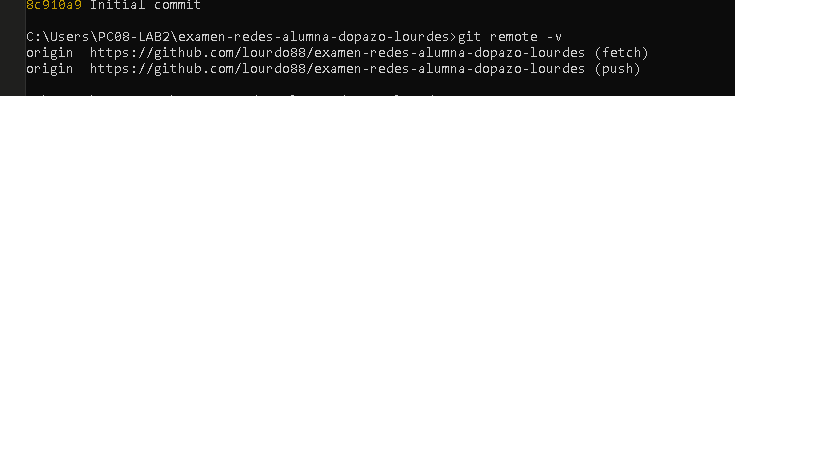
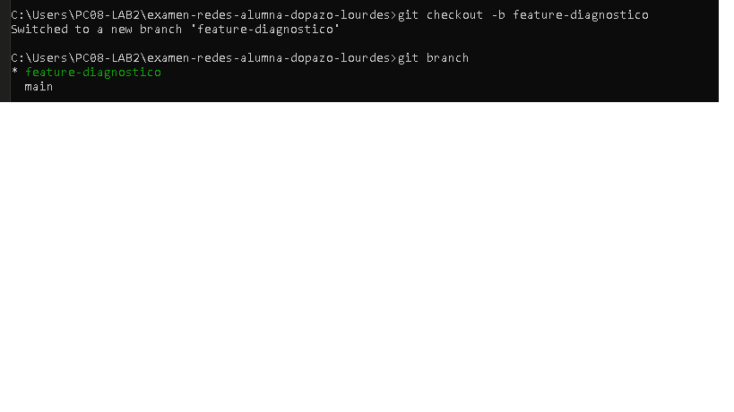
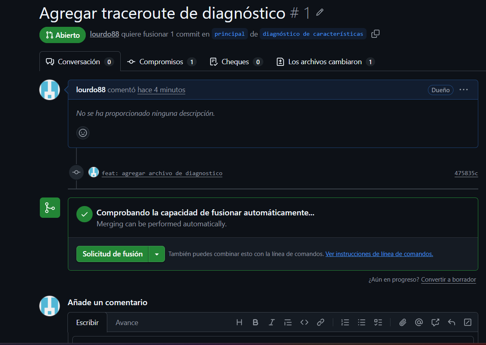

# TP Evaluativo - Redes
**Alumno:** [DOPAZO LOURDES]  
**Fecha:** [[29/05/2008]  
**Plataforma:** GitLab/GitHub
**Repositorio:** [(https://github.com/lourdo88/examen-redes-alumna-dopazo-lourdes)]  

---

## Item 1 – Configuración de IP estática y conectividad

### Capturas






### Salidas de comandos (texto)
````bash
[Pegá acá la salida COMPLETA de ipconfig /all despues de la configuraciဝn de IP estática]
````

````bash
[Pega acá la salida del ping -n 4 al dominio solicitado. Con IP estática]
````

### Respuestas a las preguntas

1. .¿Qué criterio usaste para elegir tu IP esttica?
   Elegí una IP dentro del mismo rango de red (10.103.103.x) con un número que no estuviera ocupado por otro dispositivo. Para evitar conflictos, verifiqué con ping que la IP no tuviera respuesta antes de asignarla. 

2. ¿Por qu el enunciado prohibe usar los DNS de Google?
   Porque en redes corporativas o educativas se suelen usar DNS propios por razones de control, privacidad y políticas de red. Usar DNS externos como los de Google puede saltear filtros de contenido o exponer consultas DNS a terceros.  

---

## Item 2 – Trazado de ruta y conexiρnes activas


### Capturas






### Salidas de comandos (texto)
````bash
[Pega acá la salida de tracert al dominio]
````

````bash
[Pegá acá la salida de netstat -n | findstr :443]
````

### Respuesta

1. Salto con mayor latencia / cantidad de saltos >100ms  

2. Conexiones al puerto indicado  
   

---


## Item 3 – Consultas DNS y Resource Records


### Capturas




### Salidas de comandos (texto)

#### nslookup dominio
````bash
[Pega acá la salida del primer nslookup al dominio]
````

#### nslookup MX
````bash
[Pega acá la salida de nslookup -type=MX]
````

#### nslookup DNS
````bash
[Pegá acá la salida de nslookup a DNS externo]
````

### Respuestas

1. IP del dominio principal   

2. RR DNS  

3. Comparación con DNS por defecto

---

## Item 4 – Verificacyሁn del repositorio y remoto

### Capturas






### Salidas de comandos (texto)

````bash
[Pega acá la salida de git log --oneline]
````

````bash
[Pega acá la salida de git remote -v]
````

---

## Item 5 – Rama, Merge Request y análisis

### Capturas






### Salidas de comandos

````bash
[Pega acá la salida de git branch]
````

### Respuestas
